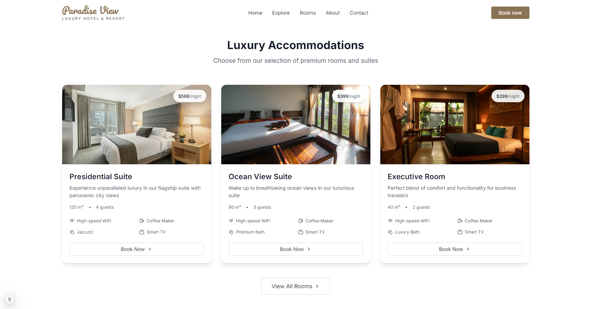

# 🏨 Luxury Hotel Room Booking System

<div align="center">
  
</div>

<div align="center">
  
  [](https://nextjs.org/)
  [](https://www.typescriptlang.org/)
  [](https://tailwindcss.com/)
  [](https://www.mongodb.com/)
  
</div>

## ✨ Features

- 🎯 **Modern UI/UX**: Beautiful and responsive design with premium aesthetics
- 🔐 **User Authentication**: Secure login and registration system
- 🏷️ **Real-time Booking**: Instant room availability and booking confirmation
- 💳 **Payment Integration**: Secure payment processing system
- 📱 **Mobile Responsive**: Perfect experience across all devices
- 🌙 **Dark Mode**: Eye-friendly dark theme option
- 🔍 **Advanced Search**: Filter rooms by date, type, and amenities
- 📊 **Admin Dashboard**: Comprehensive booking management system

## 🖼️ Screenshots

<div align="center">
  
  
</div>

<div align="center">
  
  
</div>

<div align="center">
  
  
</div>

## 🚀 Tech Stack

- **Frontend**
  - Next.js 13 (App Router)
  - TypeScript
  - Tailwind CSS
  - Framer Motion
  - React Hook Form

- **Backend**
  - Node.js
  - Express.js
  - MongoDB
  - JWT Authentication

- **DevOps**
  - Docker
  - GitHub Actions
  - Vercel Deployment

## 🛠️ Installation

1. Clone the repository
```bash
git clone https://github.com/praveenkavindu/hotel-room-booking-nsbm.git
```

2. Install dependencies
```bash
cd hotel-room-booking-nsbm
npm install
```

3. Set up environment variables
```bash
cp .env.example .env
# Add your environment variables
```

4. Run the development server
```bash
npm run dev
```

## 💡 Usage

Visit `http://localhost:3000` to view the application.

- 👤 **User Access**
  - Browse available rooms
  - Make bookings
  - View booking history
  - Update profile

- 👑 **Admin Access**
  - Manage rooms
  - Handle bookings
  - View analytics
  - User management

## 👨‍💻 Developer

<div align="center">
  
  
  ### Praveen Kavindu
  Software Engineering Graduate at Plymouth University
  
  [](https://github.com/praveenkavindu)
  [](https://www.linkedin.com/in/praveen-kavindu)
  [](mailto:praveenkavindu@gmail.com)
</div>

## 📄 License

This project is licensed under the MIT License - see the [LICENSE](LICENSE) file for details.

---

<div align="center">
  Made with ❤️ by Praveen Kavindu
</div>
